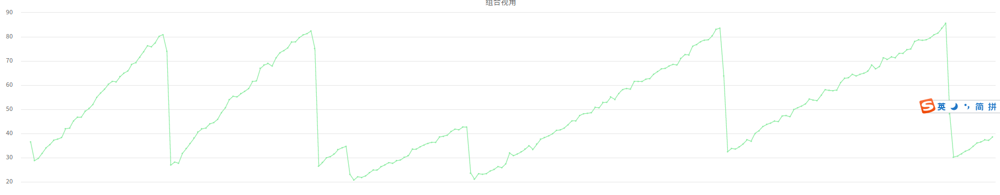
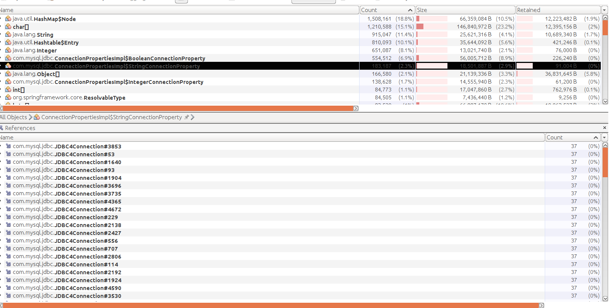
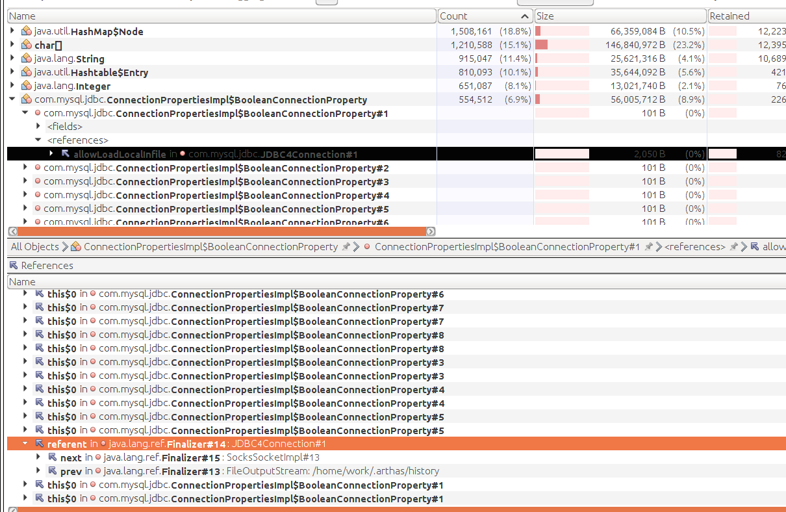
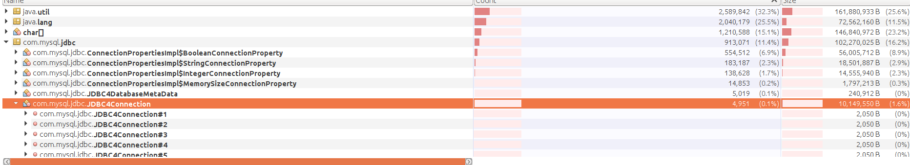

HeapMemoryUseRate 使用率过高问题

每几天就会上一个峰值

通过arthas的heapdump命令将内存dump 到本地,再通过visualvm分析

# [java问题之1：Java的Finalizer引发的内存溢出 ](https://www.cnblogs.com/duanxz/p/10275778.html)

加快finalizer里面的回收，但是看代码里面有相关的代码。可能有别的原因

