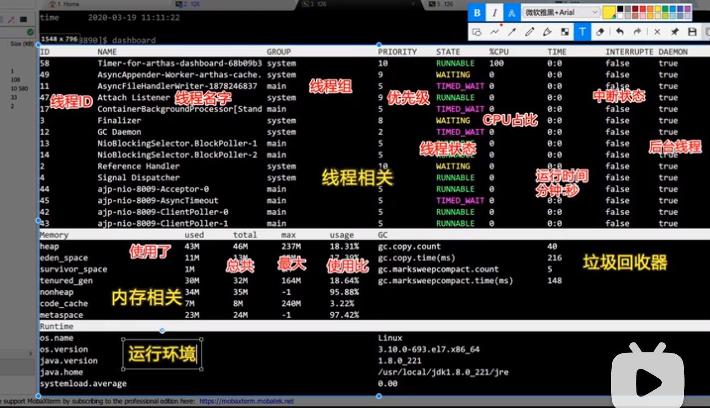

# Arthas

Arthas is a Java diagnostic tool。

常用命令：

dashboard         

显示实时数据的面板

​       

thread -n 3

查看繁忙的进程

thread --state waiting

查看状态为等待的

jvm

jad *Main

反编译代码，查看真实的代码

​                                                          

trace  com.xxx.poxy getZone '#cost>700 && params[0].equals("intl_pointsmall_tasks")'

watch  com.xxx.poxy getZon "{params,returnObj}" -x 2

查看类的信息和静态变量的信息

sc -d -f com.xxx

ongl 表达式 执行 静态方法

