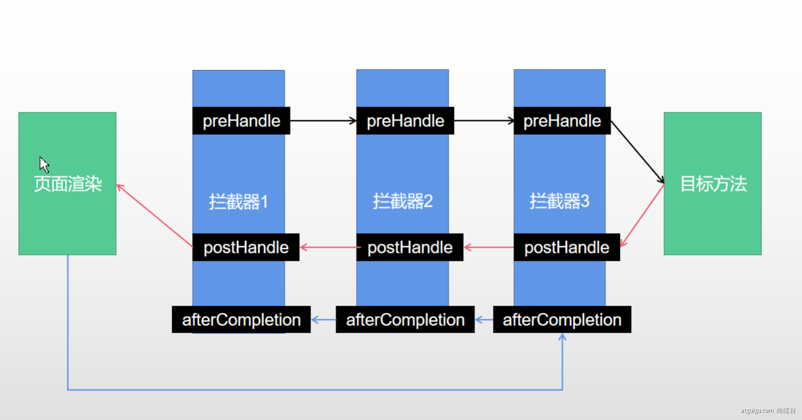

# 过滤器

对于过滤器和拦截器的区别， [知乎@Kangol LI](https://www.zhihu.com/question/35225845/answer/61876681) 的回答很不错。

- 过滤器（Filter）：当你有一堆东西的时候，你只希望选择符合你要求的某一些东西。定义这些要求的工具，就是过滤器。
- 拦截器（Interceptor）：在一个流程正在进行的时候，你希望干预它的进展，甚至终止它进行，这是拦截器做的事情。

