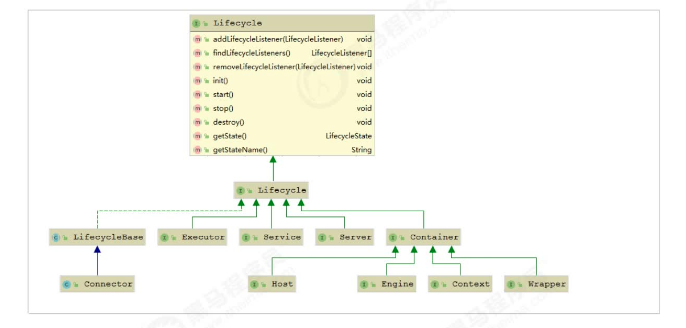

Tomcat 采用了类似的办法来管理组件的生命周期，

主要有两个要点，一是父组件负责子组件的创建、启停和销毁。

这样只要启动最上层组件，整个 Web 容器就被启动起来了，也就实现了一键式启停；

二是 Tomcat 和 Jetty 都定义了组件的生命周期状态，并且把组件状态的转变定义成一个事件，一个组件的状态变化会触发子组件的变化，比如 Host容器的启动事件里会触发 Web 应用的扫描和加载，最终会在 Host 容器下创建相应的Context 容器，而 Context 组件的启动事件又会触发 Servlet 的扫描，进而创建 Wrapper组件。那么如何实现这种联动呢？答案是观察者模式。具体来说就是创建监听器去监听容器的状态变化，在监听器的方法里去实现相应的动作，这些监听器其实是组件生命周期过程中的“扩展点”。

由于所有的组件均存在初始化、启动、停止等生命周期方法，拥有生命周期管理的特性，所以Tomcat在设计的时候，基于生命周期管理抽象成了一个接口Lifecycle，而组件Server、Service、Container、Executor、Connector组件，都实现了一个生命周期的接口，从而具有了以下生命周期中的核心方法：

