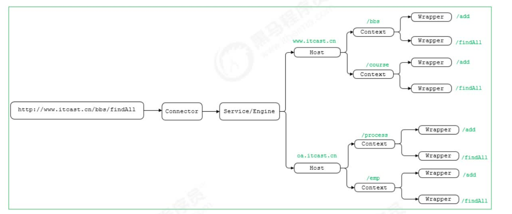
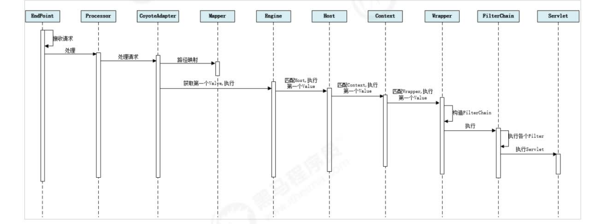

下面的示意图中，就描述了当用户请求链接http://www.itcast.cn/bbs/findAll之后,是如何找到最终处理业务逻辑的servlet。

那上面这幅图只是描述了根据请求的URL如何查找到需要执行的Servlet，那么下面我们再来解析一下，从Tomcat的设计架构层面来分析Tomcat的请求处理。

1)Connector组件Endpoint中的Acceptor监听客户端套接字连接并接收Socket。

2)将连接交给线程池Executor处理，开始执行请求响应任务。

3)Processor组件读取消息报文，解析请求行、请求体、请求头，封装成Request对象。4)Mapper组件根据请求行的URL值和请求头的Host值匹配由哪个Host容器、Context容器、Wrapper容器处理请求。

5)CoyoteAdaptor组件负责将Connector组件和Engine容器关联起来，把生成的Request对象和响应对象Response传递到Engine容器中，调用Pipeline。

6)Engine容器的管道开始处理，管道中包含若干个Valve、每个Valve负责部分处理逻辑。执行完Valve后会执行基础的Valve--StandardEngineValve，负责调用Host容器的Pipeline。

7)Host容器的管道开始处理，流程类似，最后执行Context容器的Pipeline。

8)Context容器的管道开始处理，流程类似，最后执行Wrapper容器的Pipeline。

9)Wrapper容器的管道开始处理，流程类似，最后执行Wrapper容器对应的Servlet对象的处理方法。

前面所讲解的Tomcat的整体架构中，我们发现Tomcat中的各个组件各司其职，组件之间松耦合，确保了整体架构的可伸缩性和可拓展性，那么在组件内部，如何增强组件的灵活性和拓展性呢？在Tomcat中，每个Container组件采用责任链模式来完成具体的请求处理。在Tomcat中定义了Pipeline和Valve两个接口，Pipeline用于构建责任链，后者代表责任链上的每个处理器。Pipeline中维护了一个基础的Valve，它始终位于Pipeline的末端（最后执行），封装了具体的请求处理和输出响应的过程。当然，我们也可以调用addValve()方法，为Pipeline添加其他的Valve，后添加的Valve位于基础的Valve之前，并按照添加顺序执行。Pipiline通过获得首个Valve来启动整合链条的执行。