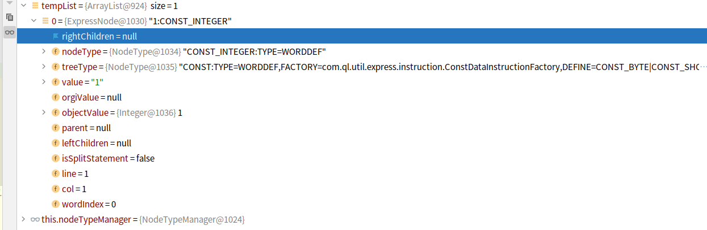

```
String exp = "1";
```

###### 

nodeType 和 TreeType 之间的关系


1:   STAT_BLOCK:STAT_BLOCK                                                         	STAT_BLOCK
2:      STAT_SEMICOLON:STAT_SEMICOLON	STAT_SEMICOLON
3:         1:CONST_INTEGER	CONST


生成的root是这样的


