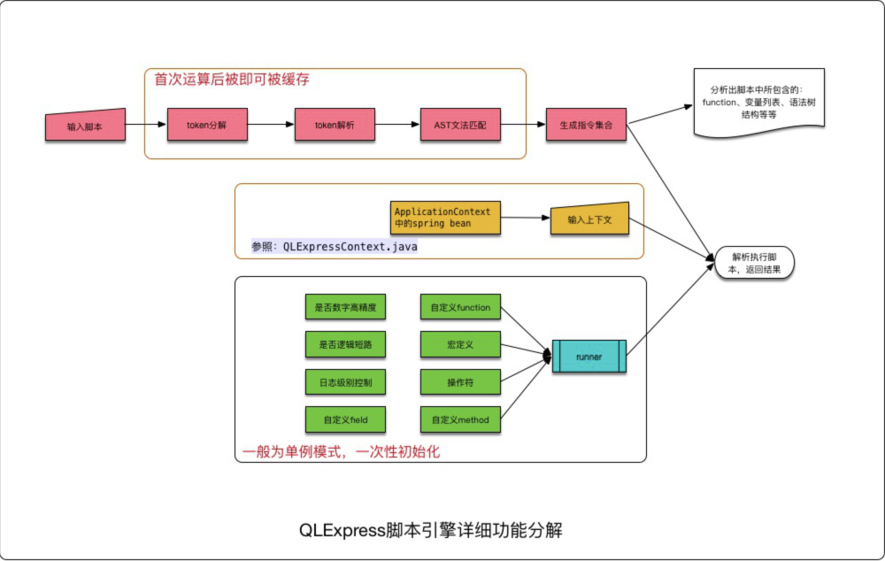

QLExpress 在指令解析的时候如 Java 的指令解析类似，会将输入脚本（提前定义好的脚本)->将表达式进行 token 分解->token 解析->AST 文法匹配->最终生产指令集合。这里猜测当时的借鉴思想来源于 Java。


# init phase

```java
static String[][] splitProperties(String str) {
   Pattern p = Pattern.compile("(,|:)\\s*(([A-Z]|-|_)*)\\s*=");
   Matcher matcher = p.matcher(str);
   List<String[]> list = new ArrayList<String[]>();
   int endIndex = 0;
   while (matcher.find()) {
      if (list.size() > 0) {
         list.get(list.size() - 1)[1] = str.substring(endIndex,
               matcher.start()).trim();
      }
      list.add(new String[2]);
      list.get(list.size() - 1)[0] = str.substring(matcher.start() + 1,
            matcher.end() - 1).trim();
      endIndex = matcher.end();
   }
   if (list.size() > 0) {
      list.get(list.size() - 1)[1] = str.substring(endIndex).trim();
   }
   return (String[][]) list.toArray(new String[0][2]);
}
```


```java
QLMatchResult result = QLPattern.findMatchStatement(this.nodeTypeManager, this.nodeTypeManager
            .findNodeType("PROGRAM").getPatternNode(), tempList,0);
```

templist是词法分析的结果，是一个 List<ExpressNode>

result是语法分析的结果


怎么由 templist 到result的呢


https://xie.infoq.cn/article/6d94f63187b0335fb98f9149c