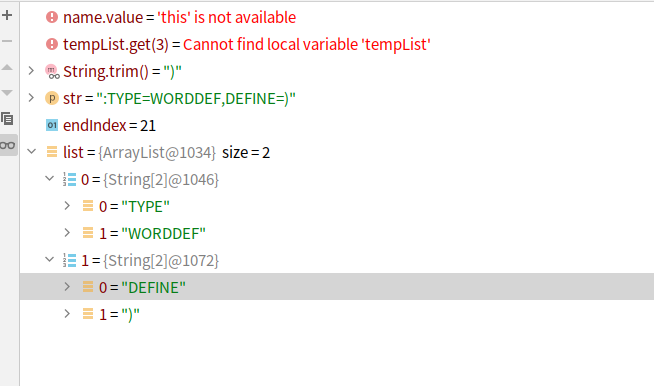

# init phase

```java
static String[][] splitProperties(String str) {
   Pattern p = Pattern.compile("(,|:)\\s*(([A-Z]|-|_)*)\\s*=");
   Matcher matcher = p.matcher(str);
   List<String[]> list = new ArrayList<String[]>();
   int endIndex = 0;
   while (matcher.find()) {
      if (list.size() > 0) {
         list.get(list.size() - 1)[1] = str.substring(endIndex,
               matcher.start()).trim();
      }
      list.add(new String[2]);
      list.get(list.size() - 1)[0] = str.substring(matcher.start() + 1,
            matcher.end() - 1).trim();
      endIndex = matcher.end();
   }
   if (list.size() > 0) {
      list.get(list.size() - 1)[1] = str.substring(endIndex).trim();
   }
   return (String[][]) list.toArray(new String[0][2]);
}
```




```java
QLMatchResult result = QLPattern.findMatchStatement(this.nodeTypeManager, this.nodeTypeManager
            .findNodeType("PROGRAM").getPatternNode(), tempList,0);
```

templist是词法分析的结果，是一个 List<ExpressNode>

result是语法分析的结果


怎么由 templist 到result的呢


提升活动配置效率，活动创建后自动添加变量

排查积分商城preview环境接口返回400


提升活动配置效率，活动创建后自动添加奖品

升级qlexpress规则引擎

