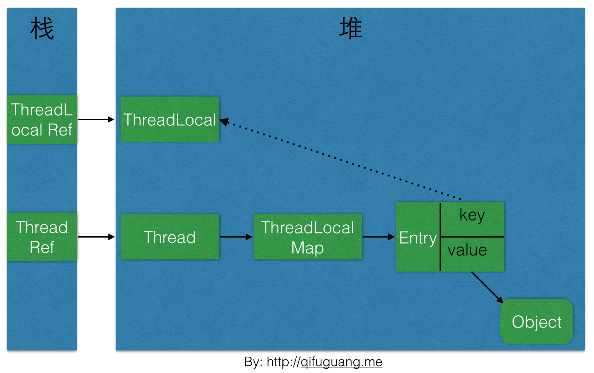

# threadlocal

线程独享变量

##  问题

线程回收后

图解

# 实际问题

线程池 parallelStream

[ThreadLocal原理分析与使用场景](https://www.cnblogs.com/luxiaoxun/p/8744826.html)

# [ThreadLocal类分析](https://www.cnblogs.com/cz123/p/7469245.html)