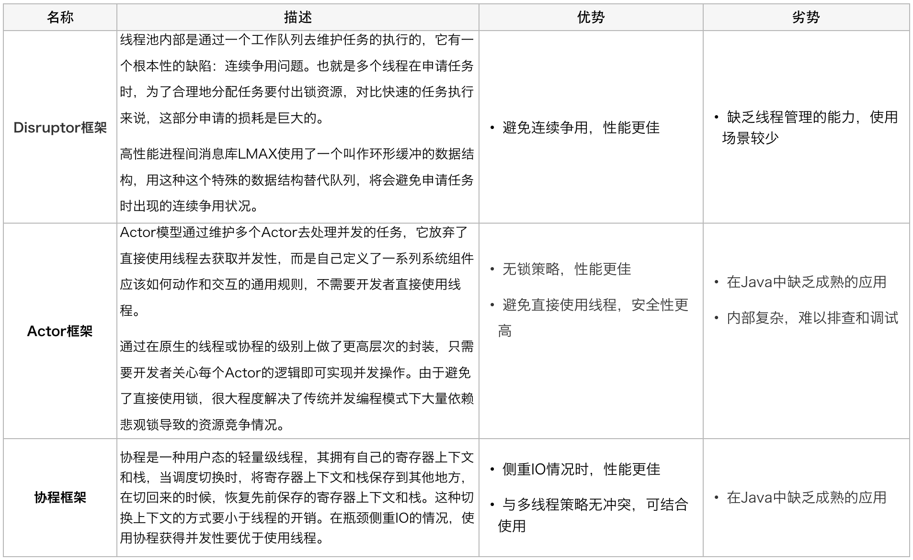

## ThreadPoolExecutor 参数说明

```java
    public ThreadPoolExecutor(int corePoolSize,
                              int maximumPoolSize,
                              long keepAliveTime,
                              TimeUnit unit,
                              BlockingQueue<Runnable> workQueue,
                              ThreadFactory threadFactory,
                              RejectedExecutionHandler handler)
```

- corePoolSize：核心线程池的大小。当提交一个任务到线程池时，核心线程池会创建一个核心线程来执行任务，即使其他核心线程能够执行新任务也会创建线程，等到需要执行的任务数大于核心线程池基本大小时就不再创建。如果调用了线程池的 prestartAllCoreThreads() 方法，核心线程池会提前创建并启动所有核心线程。

- workQueue：任务队列。当核心线程池中没有线程时，所提交的任务会被暂存在队列中。Java 提供了多种[阻塞队列](https://www.cnblogs.com/jmcui/p/11442616.html)。

- maximumPoolSize：线程池允许创建的最大线程数。如果队列也满了，并且已创建的线程数小于最大线程数，则线程池会再创建新的空闲线程执行任务。值得注意的是，如果使用了无界的任务队列则这个参数不起作用。

- keepAliveTime：当线程池中的线程数大于 corePoolSize 时，keepAliveTime 为多余的空闲线程等待新任务的最长时间，超过这个时间后多余的线程将被终止。所以，如果任务很多，并且每个任务执行的时间比较短，可以调大时间，提高线程的利用率。值得注意的是，如果使用了无界的任务队列则这个参数不起作用。

- TimeUnit：线程活动保持时间的单位。

- threadFactory：创建线程的工厂。可以通过线程工厂给每个创建出来的线程设置符合业务的名字。

  ```java
  // 依赖 guava
  new ThreadFactoryBuilder().setNameFormat("xx-task-%d").build();
  ```

- handler：饱和策略。当队列和线程池都满了，说明线程池处于饱和状态，那么必须采取一种策略处理提交的新任务。Java 提供了以下4种策略：

  - AbortPolicy：默认。直接抛出异常。
  - CallerRunsPolicy：只用调用者所在线程来运行任务。
  - DiscardOldestPolicy：丢弃队列里最近的一个任务，并执行当前任务。
  - DiscardPolicy：不处理，丢弃掉。
  
- 阻塞队列

  - 


# [线程池中的一个线程异常了会被怎么处理?](https://www.cnblogs.com/tiancai/p/14003897.html)

1、execute方法,可以看异常输出在控制台，而submit在控制台没有直接输出，必须调用Future.get()方法时，可以捕获到异常。

2、一个线程出现异常不会影响线程池里面其他线程的正常执行。

3、线程不是被回收而是线程池把这个线程移除掉，同时创建一个新的线程放到线程池中。


###  生命周期管理

ThreadPoolExecutor的运行状态有5种，分别为：


其生命周期转换如下入所示：


### 任务执行机制

其执行流程如下图所示：


### 实际问题及方案思考

线程池使用面临的核心的问题在于：**线程池的参数并不好配置**。


可以替换线程池方案




[美团线程池](https://tech.meituan.com/2020/04/02/java-pooling-pratice-in-meituan.html)