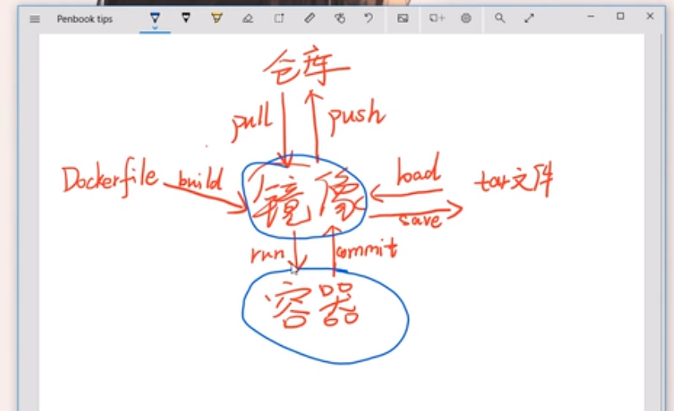

## 是什么

轻量级的虚拟化方案




## 命令

ps

查看容器运行状态


-d 后台运行


-p 映射端口 -p 80:81 外部的 80 映射 里面的 81


exc -it   352da51d06c1 /bin/bash 

使用 /bin/bash 进入352da51d06c1容器内部


## dockfile

```dockerfile
FROM	//父亲节点

WORKDIR 	//工作目录

ADD  	//添加

COPY

RUN					//运行脚本

CMD					

ENTRYPOINT //运行脚本

ENV  //参数 持续永久

ARG   // 构建时参数

LABEL  //标示

ONBUILD //让子容器继承

SHELL /bin/sh
```


https://github.com/docker/getting-started