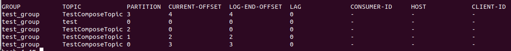

### 列出所有 Topic

```
/usr/local/kafka/bin/kafka-topics.sh --list --zookeeper localhost:2181 
```


## 消费消息

### 从头开始

```
/usr/local/kafka/bin/kafka-console-consumer.sh --bootstrap-server localhost:9092 --topic test --from-beginning
```


### 消费者 Group 列表

```
kafka-consumer-groups.sh --bootstrap-server localhost:9092 --list
```


### 查看 Group 详情

```
/usr/local/kafka/bin/kafka-consumer-groups.sh --bootstrap-server localhost:9093 --group test_group --describe
```





```
# CURRENT-OFFSET: 当前消费者群组最近提交的 offset，也就是消费者分区里读取的当前位置  ???q

# LOG-END-OFFSET: 当前最高水位偏移量，也就是最近一个读取消息的偏移量，同时也是最近一个提交到集群的偏移量 

# LAG：消费者的 CURRENT-OFFSET 与 broker 的 LOG-END-OFFSET 之间的差距
```


