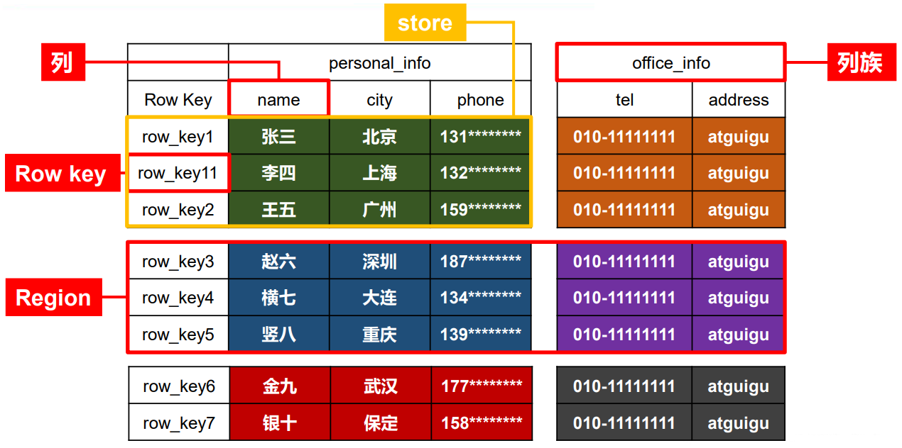
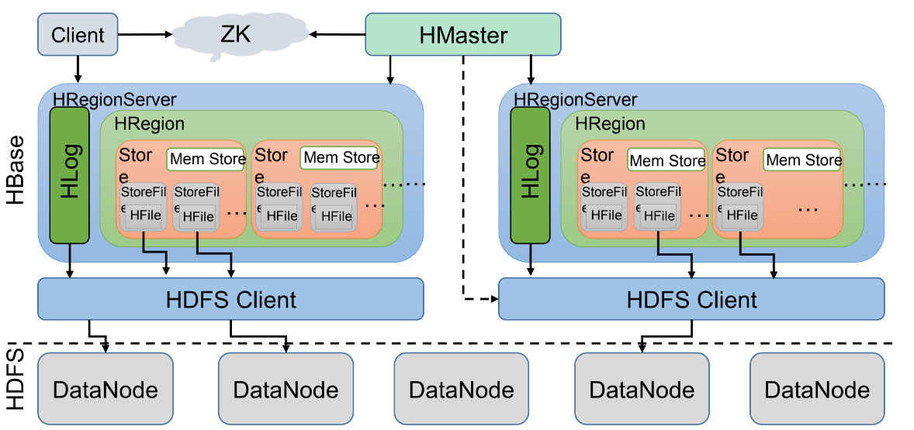

属于nosql

 Being a FS, HDFS lacks the random read/write capability. It is good for sequential data access. And this is where HBase comes into picture. It is a NoSQL database that runs on top your Hadoop cluster and provides you random real-time read/write access to your data.

## Features特征

- Strictly consistent reads and writes.严格一致的读写。

  什么意思呢

https://www.cnblogs.com/jhxxb/p/11597003.html

# [Difference between HBase and Hadoop/HDFS](https://stackoverflow.com/questions/16929832/difference-between-hbase-and-hadoop-hdfs)

[hbase为什么这么快](https://www.modb.pro/db/46150)

