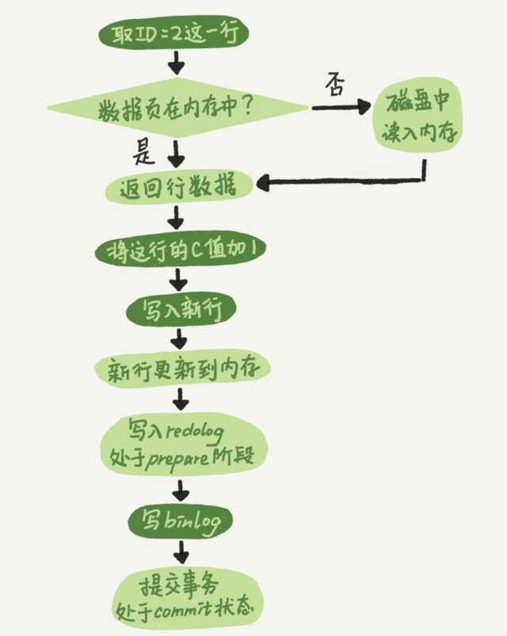

#  “order by”是怎么工作的？

```
select city,name,age from t where city='杭州' order by name limit 1000 ;
```


Mysql 有两种方式可以生成排序结果：通过排序操作；或者按索引顺序扫描。

**索引最好既满足排序，又用于查找行**。这样，就可以通过命中覆盖索引直接将结果查出来，也就不再需要排序了。

这样整个查询语句的执行流程就变成了：

1. 从索引 (city,name,age) 找到第一个满足 city='杭州’条件的记录，取出其中的 city、name 和 age 这三个字段的值，作为结果集的一部分直接返回；
2. 从索引 (city,name,age) 取下一个记录，同样取出这三个字段的值，作为结果集的一部分直接返回；
3. 重复执行步骤 2，直到查到第 1000 条记录，或者是不满足 city='杭州’条件时循环结束。


## 全字段排序

以我们前面举例用过的市民表为例，假设你要查询城市是“杭州”的所有人名字，并且按照姓名排序返回前 1000 个人的姓名、年龄。

Extra 这个字段中的“Using filesort”表示的就是需要排序，MySQL 会给每个线程分配一块内存用于排序，称为 sort_buffer。

通常情况下，这个语句执行流程如下所示 ：

1.初始化 sort_buffer，确定放入 name、city、age 这三个字段；

2.从索引 city 找到第一个满足 city=’杭州’条件的主键 id，也就是图中的 ID_X；

3.到主键 id 索引取出整行，取 name、city、age 三个字段的值，存入 sort_buffer 中；

4.从索引 city 取下一个记录的主键 id；

5.重复步骤 3、4 直到 city 的值不满足查询条件为止，对应的主键 id 也就是图中的 ID_Y；

6.对 sort_buffer 中的数据按照字段 name 做快速排序；

7.按照排序结果取前 1000 行返回给客户端。


sort_buffer_size，就是 MySQL 为排序开辟的内存（sort_buffer）的大小。如果要排序的数据量小于 sort_buffer_size，排序就在内存中完成。但如果排序数据量太大，内存放不下，则不得不利用磁盘临时文件辅助排序。

可以用下面的方法，来确定一个排序语句是否使用了临时文件。

```
/* 打开 optimizer_trace，只对本线程有效 */
SET optimizer_trace='enabled=on'; 
 
/* @a 保存 Innodb_rows_read 的初始值 */
select VARIABLE_VALUE into @a from  performance_schema.session_status where variable_name = 'Innodb_rows_read';
 
/* 执行语句 */
select city, name,age from t where city='杭州' order by name limit 1000; 
 
/* 查看 OPTIMIZER_TRACE 输出 */
SELECT * FROM `information_schema`.`OPTIMIZER_TRACE`\G
 
/* @b 保存 Innodb_rows_read 的当前值 */
select VARIABLE_VALUE into @b from performance_schema.session_status where variable_name = 'Innodb_rows_read';
 
/* 计算 Innodb_rows_read 差值 */
select @b-@a;
```


number_of_tmp_files 表示的是，排序过程中使用的临时文件数。你一定奇怪，为什么需要 12 个文件？内存放不下时，就需要使用外部排序，外部排序一般使用归并排序算法。可以这么简单理解，MySQL 将需要排序的数据分成 12 份，每一份单独排序后存在这些临时文件中。然后把这 12 个有序文件再合并成一个有序的大文件。


todoqifei


## mysql 执行原理


  　　查询的生命周期的下一步是将一个SQL转换成一个执行计划，mysql在依照这个执行计划和存储引擎进行交互。这包含多个子阶段：***解析SQL、预处理、优化SQL执行计划***。这个过程中任何错误都可能终止查询。

- 语法解析器和预处理：首先mysql通过关键字将SQL语句进行解析，并生成一颗对应的“解析树”。mysql解析器将使用mysql语法规则验证和解析查询；预处理器则根据一些mysql规则进一步检查解析数是否合法。
- 查询优化器：当语法树被认为是合法的了，并且由优化器将其转化成执行计划。一条查询可以有很多种执行方式，最后都返回相同的结果。优化器的作用就是找到这其中最好的执行计划。
- 执行计划：mysql不会生成查询字节码来执行查询，mysql生成查询的一棵指令树，然后通过存储引擎执行完成这棵指令树并返回结果。最终的执行计划包含了重构查询的全部信息。


读的过程，大致就是上面的流程。写的话，也会走上面的流程：连接、缓存、解析器、处理器、优化器、执行器。

不同的是，写会把缓存清空。接下来，解析器会通过词法和语法解析知道这是一条更新语句。优化器决定要使用 哪个索引。然后，执行器负责具体执行，找到这一行，然后更新。

与读流程不一样的是，写流程还涉及两个重要的日志模块，它们正是：redo log（重做日志）和 binlog（归档日志）。


### ------执行器和 InnoDB 引擎在执行update语句时的内部流程

例如： update T set c=c+1 where ID=2;

1. 执行器先找引擎取 ID=2 这一行。ID 是主键，引擎直接用树搜索找到这一行。如果 ID=2这一行所在的数据页本来就在内存中，就直接返回给执行器；否则，需要先从磁盘读入内存，然后再返回。
2. 执行器拿到引擎给的行数据，把这个值加上 1，比如原来是 N，现在就是 N+1，得到新的一行数据，再调用引擎接口写入这行新数据。
3. 引擎将这行新数据更新到内存中，同时将这个更新操作记录到 redo log 里面，此时 redolog 处于 prepare 状态。然后告知执行器执行完成了，随时可以提交事务。
4. 执行器生成这个操作的 binlog，并把 binlog 写入磁盘。
5. 执行器调用引擎的提交事务接口，引擎把刚刚写入的 redo log 改成提交（commit）状态，更新完成。这里我给出这个 update 语句的执行流程图，图中浅色框表示是在 InnoDB 内部执行的，深色框表示是在执行器中执行的。

 

 最后三步看上去有点“绕”，将 redo log 的写入拆成了两个步骤：prepare 和 commit，这就是"两阶段提交"。

为什么必须有“两阶段提交”呢？这是为了让两份日志之间的逻辑一致。


reference

[MySQL order by 原理](http://weikeqin.com/2019/05/06/mysql-order-by/)

# [MySQL解析过程、执行过程](https://www.cnblogs.com/fanguangdexiaoyuer/p/10268570.html)