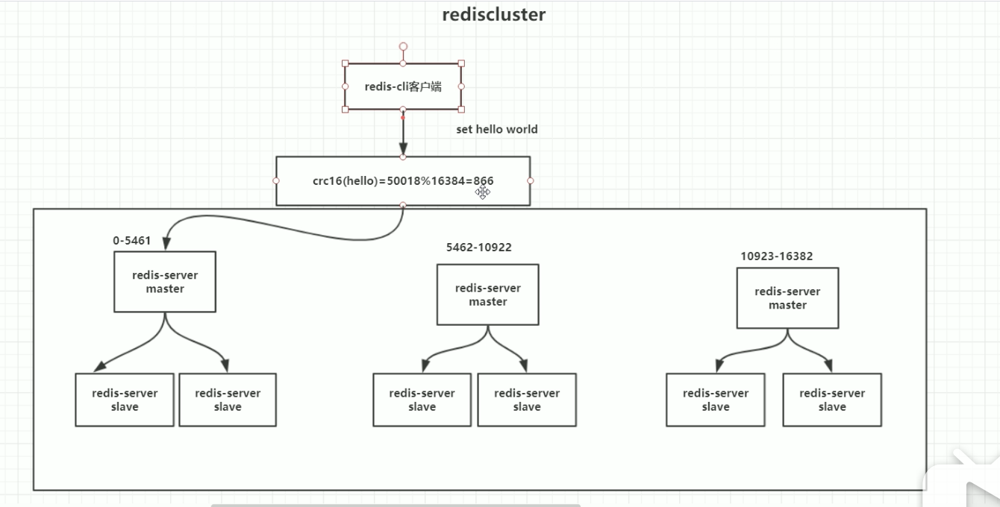

## todo
slot怎么迁移
怎么实现自动化的扩容，缩容



配置
cluster-enabled yes

如果开启集群配置，但没有配置详细信息，那么会提示
hash slot not served

## 搭建步骤

redis-cil --cluster create host:port --cluster-replicas 1

最少3个master 节点


# slot的算法

crc16，或者自己指定

slot怎么迁移


### 重新分片

将slot切换节点


## 扩容


## 缩容

先迁移slot


## 命令 
cluster info 查看集群信息

cluster nodes 查看节点信息

cluster add-node  增加节点

cluster reshared  重新分配slot


### 客户端

当以单机运行时候,如果当前的slot不由该节点负责则返回MOVED错误

```redis
set t "222"
(error) MOVED 15891 172.20.0.6:6379
```


#### ask错误

如果节点A正在迁移slot 到节点B，那么节点A没能在自己的数据库中找到对应的key时候，节点A会向客户端返回一个ask错误


### 故障检测

节点定期的向集群中其他节点发送ping消息，来检测对方是否下线


## 设计原理


### 为什么RedisCluster会设计成16384个槽呢?

**1.如果槽位为65536，发送心跳信息的消息头达8k，发送的心跳包过于庞大。**

如上所述，在消息头中，最占空间的是 `myslots[CLUSTER_SLOTS/8]`。 当槽位为65536时，这块的大小是: `65536÷8÷1024=8kb`因为每秒钟，redis节点需要发送一定数量的ping消息作为心跳包，如果槽位为65536，这个ping消息的消息头太大了，浪费带宽。

**2.redis的集群主节点数量基本不可能超过1000个。**

如上所述，集群节点越多，心跳包的消息体内携带的数据越多。如果节点过1000个，也会导致网络拥堵。因此redis作者，不建议redis cluster节点数量超过1000个。 那么，对于节点数在1000以内的redis cluster集群，16384个槽位够用了。没有必要拓展到65536个。

**3.槽位越小，节点少的情况下，压缩率高**

Redis主节点的配置信息中，它所负责的哈希槽是通过一张bitmap的形式来保存的，在传输过程中，会对bitmap进行压缩，但是如果bitmap的填充率slots / N很高的话(N表示节点数)，bitmap的压缩率就很低。 如果节点数很少，而哈希槽数量很多的话，bitmap的压缩率就很低。


redis 为什么要发送心跳包呢

为了和其他节点保持同步


### 为什么RedisCluster不使用一致性hash算法?


https://whetherlove.github.io/2018/10/07/Redis%E9%9B%86%E7%BE%A4-Cluster%E5%AE%9E%E7%8E%B0%E5%8E%9F%E7%90%86/