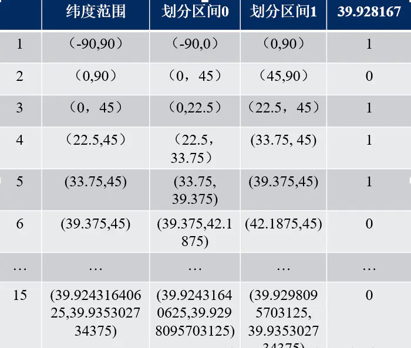
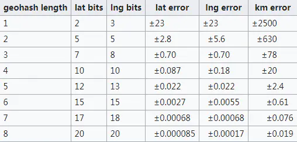

[geohash的实现](https://segmentfault.com/a/1190000020977911)


GEOADD原理：

将经纬度转化为52位得geohash值

调用ZADD命令将member和其对应得score存入集合中


### geohash 算法

Geohash算法就是将经纬度编码，将二维变一维，给地址位置分区的一种算法。

[GEOHASH算法原理和实现](https://www.jianshu.com/p/2fd0cf12e5ba)


**Geohash算法**

Geohash算法一共有三步。

**首先将经纬度变成二进制。**

比如这样一个点（39.923201, 116.390705）
 纬度的范围是（-90，90），其中间值为0。对于纬度39.923201，在区间（0，90）中，因此得到一个1；（0，90）区间的中间值为45度，纬度39.923201小于45，因此得到一个0，依次计算下去，即可得到纬度的二进制表示，如下表：



最后得到纬度的二进制表示为：


```undefined
  10111000110001111001
```

同理可以得到经度116.390705的二进制表示为：


```undefined
  11010010110001000100
```

**第2步，就是将经纬度合并。**

经度占偶数位，纬度占奇数位，注意，0也是偶数位。


```undefined
  11100 11101 00100 01111 00000 01101 01011 00001
```

**第3步，按照Base32进行编码**

Base32编码表的其中一种如下，是用0-9、b-z（去掉a, i, l, o）这32个字母进行编码。具体操作是先将上一步得到的合并后二进制转换为10进制数据，然后对应生成Base32码。需要注意的是，将5个二进制位转换成一个base32码。上例最终得到的值为


```undefined
  wx4g0ec1
```

Geohash比直接用经纬度的高效很多，而且使用者可以发布地址编码，既能表明自己位于北海公园附近，又不至于暴露自己的精确坐标，有助于隐私保护。

- GeoHash用一个字符串表示经度和纬度两个坐标。在数据库中可以实现在一列上应用索引（某些情况下无法在两列上同时应用索引）
- GeoHash表示的并不是一个点，而是一个矩形区域
- GeoHash编码的前缀可以表示更大的区域。例如wx4g0ec1，它的前缀wx4g0e表示包含编码wx4g0ec1在内的更大范围。 这个特性可以用于附近地点搜索

编码越长，表示的范围越小，位置也越精确。因此我们就可以通过比较GeoHash匹配的位数来判断两个点之间的大概距离。




应用场景：

附近的人

怎么查找？

给一个geohash编码，怎么找到相邻的呢

