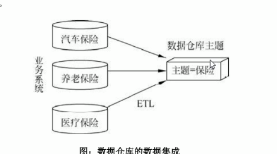

## 数据仓库

不生产数据，保存数据

## 特征

面向主题，集成性，非易失性，时变性

## 与数据库的关系

mysql 面向交易的处理，crud

hive 面向分析的处理

| mysql            | hive             |
| ---------------- | ---------------- |
| 面向交易         | 面向分析         |
| 讲究范式         | 不讲究冗余       |
|                  | 要不影响业务     |
| 面向应用，表分散 | 面向主题，表集中 |

## 分层

源数据层，数据仓库，数据应用

ETL (extra,translate,load)

分层的含义，空间换时间

## 元数据

技术元数据