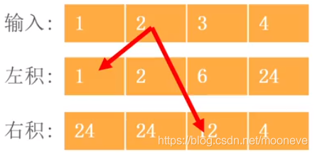

## 128 [ 最长连续序列](https://leetcode-cn.com/problems/longest-consecutive-sequence/)

当时想的是对所有的做向上的处理。后来看答案才知道只需要对最小的做就可以

```
[100,4,200,1,3,2]
```

比如说，只需要对 100 ，200，1


### 除自身以外数组的乘积

O(n) 时间复杂度，维护左积、右积数组

乘法满足结合律：a ∗ b ∗ c ∗ d ∗ e = ( a ∗ b ) ∗ c ∗ ( d ∗ e ) a*b*c*d*e = (a*b)*c*(d*e)*a*∗*b*∗*c*∗*d*∗*e*=(*a*∗*b*)∗*c*∗(*d*∗*e*)，也就是说，**每个位置上的结果等于它的左积乘上右积**
因此，我们可以维护两个数组，第一个数组记录每个位置上其左边所有数的乘积，第二个数组记录其右边所有数的乘积。



todoqifei

#### [287. 寻找重复数](https://leetcode-cn.com/problems/find-the-duplicate-number/)


给定一个包含 n + 1 个整数的数组 nums ，其数字都在 1 到 n 之间（包括 1 和 n），可知至少存在一个重复的整数。

假设 nums 只有 一个重复的整数 ，找出 这个重复的数 。

 示例 1：

输入：nums = [1,3,4,2,2]
输出：2
示例 2：

输入：nums = [3,1,3,4,2]
输出：3。