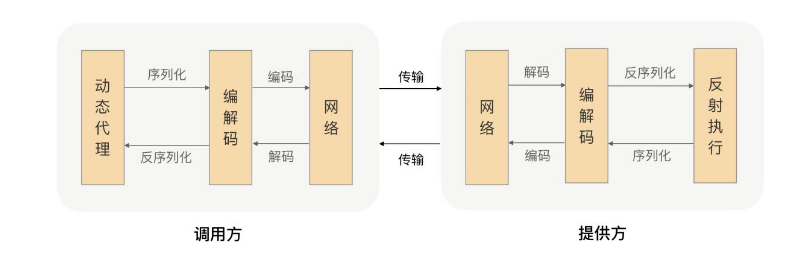

# rpc

### 如何设计一个rpc框架

# RPC简介

> RPC，全称为Remote Procedure Call，即远程过程调用，它是一个计算机通信协议。它允许像调用本地服务一样调用远程服务。RPC简介

从四方面考虑如何实现rpc：

1.通信模型：假设通信的为A机器与B机器，A与B之间有通信模型，在Java中一般基于BIO或NIO；。

2.过程（服务）定位：使用给定的通信方式，与确定IP与端口及方法名称确定具体的过程或方法；

3.远程代理对象：本地调用的方法(服务)其实是远程方法的本地代理，因此可能需要一个远程代理对象，对于Java而言，远程代理对象可以使用Java的动态对象实现，封装了调用远程方法调用；

4.序列化，将对象名称、方法名称、参数等对象信息进行网络传输需要转换成二进制传输，这里可能需要不同的序列化技术方案。如:protobuf，Arvo等。

架构的话可以分为3部分

服务提供者，运行在服务器端，提供服务接口定义与服务实现类

服务中心

服务调用者

https://pan.baidu.com/disk/pdfview?path=%2F%E5%AD%A6%E4%B9%A0%2F115-RPC%E5%AE%9E%E6%88%98%E4%B8%8E%E6%A0%B8%E5%BF%83%E5%8E%9F%E7%90%86%2F02%E4%B8%A8%E8%BF%9B%E9%98%B6%E7%AF%87%20(11%E8%AE%B2)%2F08%E4%B8%A8%E6%9C%8D%E5%8A%A1%E5%8F%91%E7%8E%B0%EF%BC%9A%E5%88%B0%E5%BA%95%E6%98%AF%E8%A6%81CP%E8%BF%98%E6%98%AFAP%EF%BC%9F.pdf

