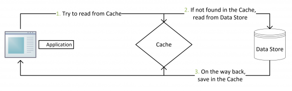
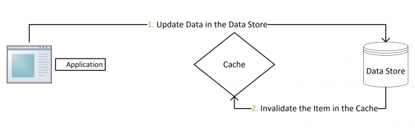

# mysql与redis缓存一致性

### Cache Expiry

给缓存设置一个过期时间

### Cache Aside

The algorithm for cache aside pattern is:

- For immutable operations (read):
  - *Cache hit:* return data from Redis directly, with no query to MySQL;
  - *Cache miss:* query MySQL to get the data *(can use read replicas to improve performance)*, save the returned data to Redis, return the result to client.
- For mutable operations (create, update, delete):
  - Create, update or delete the data to MySQL;
  - Delete the entry in Redis *(always delete rather than update the cache, the new value will be inserted when next cache miss)*.

Bad Case

If process `A` is killed before it attempts to delete the entry in Redis, that old entry will never be deleted. Hence, all other processes thereafter will keep reading the old value.

 Let’s say process `C` tries to read a value and gets a cache miss. Then `C` queries MySQL and gets the returned result. Suddenly, `C` somehow is stuck and paused by the OS for a while. At this moment, another process `D` tries to update the same value. `D` updates MySQL and has deleted the entry in Redis. After that, `C` resumes and saves its query result into Redis. Hence, `C` saves the old value into Redis and all subsequent processes will read dirty data.

This may sound scary, but its probability is very low

### Double Delete

The algorithm for double delete pattern is:

- For immutable operations (read):
  - *Cache hit:* return data from Redis directly, with no query to MySQL;
  - *Cache miss:* query MySQL to get the data *(can use read replicas to improve performance)*, save the returned data to Redis, return the result to client.
- For mutable operations (create, update, delete):
  - Delete the entry in Redis;
  - Create, update or delete the data to MySQL;
  - Sleep for a while (such as 500ms);
  - Delete the entry in Redis again.

This approach combines the original cache aside algorithm and its 1st variant. Since it is an improvement based on the original cache aside approach, we can declare that it mostly guarantees *eventual consistency* under normal scenarios. It has attempted to fix the `unhappy path` of both approaches as well.

By pausing the process for 500ms, the algorithm assumes all concurrent read processes have saved the old value into Redis and thus the 2nd delete operation on Redis will clear all dirty data. Although there does still exist a corner case where this algorithm to break eventual consistency, the probability of that would be negligible.

[一致性问题参考](https://yunpengn.github.io/blog/2019/05/04/consistent-redis-sql/)

