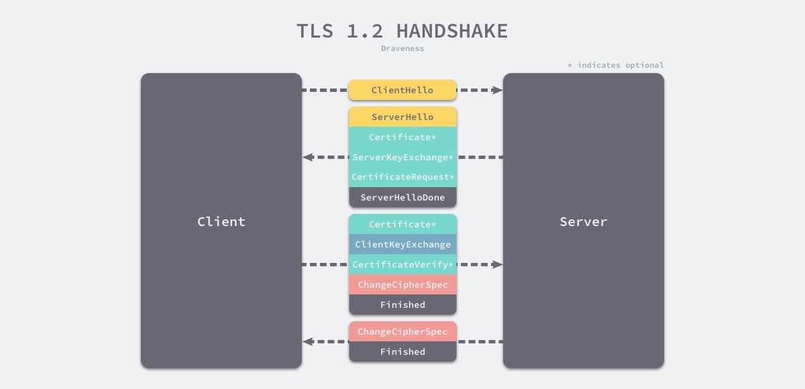

### TLS

TLS 的作用是在可靠的 TCP 协议上构建安全的传输通道，其本身是不提供可靠性保障的，我们还是需要下层可靠的传输层协议。在通信双方建立可靠的 TCP 连接之后，我们就需要通过 TLS 握手交换双方的密钥了，在这里我们将介绍 TLS 1.2 的连接建立过程[9](https://draveness.me/whys-the-design-https-latency/#fn:9)：

1. 客户端向服务端发送 Client Hello 消息，其中携带客户端支持的协议版本、加密算法、压缩算法以及**客户端生成的随机数**；
2. 服务端收到客户端支持的协议版本、加密算法等信息后；
   1. 向客户端发送 Server Hello 消息，并携带选择特定的协议版本、加密方法、会话 ID 以及**服务端生成的随机数**；
   2. 向客户端发送 Certificate 消息，即服务端的证书链，其中包含证书支持的域名、发行方和有效期等信息；
   3. 向客户端发送 Server Key Exchange 消息，传递**公钥**以及签名等信息；
   4. 向客户端发送可选的消息 CertificateRequest，验证客户端的证书；
   5. 向客户端发送 Server Hello Done 消息，通知服务端已经发送了全部的相关信息；
3. 客户端收到服务端的协议版本、加密方法、会话 ID 以及证书等信息后，验证服务端的证书；
   1. 向服务端发送 Client Key Exchange 消息，包含**使用服务端公钥加密后的随机字符串**，即预主密钥（Pre Master Secret）；
   2. 向服务端发送 Change Cipher Spec 消息，通知服务端后面的数据段会加密传输；
   3. 向服务端发送 Finished 消息，其中包含加密后的握手信息；
4. 服务端收到 Change Cipher Spec 和 Finished 消息后；
   1. 向客户端发送 Change Cipher Spec 消息，通知客户端后面的数据段会加密传输；
   2. 向客户端发送 Finished 消息，验证客户端的 Finished 消息并完成 TLS 握手；

TLS 握手的关键在于利用通信双方生成的随机字符串和服务端的公钥生成一个双方经过协商后的密钥，通信的双方可以使用这个对称的密钥加密消息防止中间人的监听和攻击，保证通信的安全。