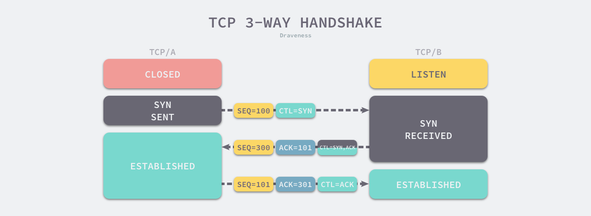
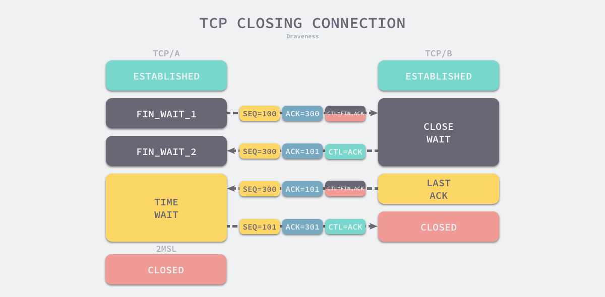

[
Java详解：TCP粘包、拆包与通信协议-](https://zhuanlan.zhihu.com/p/97699272)

TCP粘包、拆包

原因：没有消息边界

区分：给它区分个消息边界

### TCP

HTTP 协议作为应用层协议，它需要底层的传输层协议为其提供基本的数据传输功能，HTTP 协议一般都会使用 TCP 协议作为底层协议。为了阻止错误的建立历史连接，TCP 协议通信的双方会通过三次握手建立 TCP 连接[6](https://draveness.me/whys-the-design-https-latency/#fn:6)，我们在这里简单回顾一下 TCP 连接建立的整个过程。

**图 2 - TCP 三次握手**

1. 客户端向服务端发送带有 `SYN` 的数据段以及客户端开始发送数据段（Segment）的初始序列号 `SEQ = 100`；
2. 服务端收到数据段时，向客户端发送带有SYN 和ACK 的数据段；
   1. 通过返回 `ACK = 101` 确认客户端数据段的初始序列号；
   2. 通过发送 `SEQ = 300` 通知客户端，服务端开始发送数据段的初始序列号；
3. 客户端向服务端发送带有 `ACK` 的数据段，确认服务端的初始序列号，其中包含 `ACK = 301`；

### 分手过程

一个常见的关闭连接过程如下[1](https://draveness.me/whys-the-design-tcp-time-wait/#fn:1)：

1. 当客户端没有待发送的数据时，它会向服务端发送 `FIN` 消息，发送消息后会进入 `FIN_WAIT_1` 状态；
2. 服务端接收到客户端的 `FIN` 消息后，会进入 `CLOSE_WAIT` 状态并向客户端发送 `ACK` 消息，客户端接收到 `ACK` 消息时会进入 `FIN_WAIT_2` 状态；
3. 当服务端没有待发送的数据时，服务端会向客户端发送 `FIN` 消息；
4. 客户端接收到 `FIN` 消息后，会进入 `TIME_WAIT` 状态并向服务端发送 `ACK` 消息，服务端收到后会进入 `CLOSED` 状态；
5. 客户端等待**两个最大数据段生命周期**（Maximum segment lifetime，MSL）[2](https://draveness.me/whys-the-design-tcp-time-wait/#fn:2)的时间后也会进入 `CLOSED` 状态；

- 为了理解 TIME_WAIT 状态的必要性，我们先来假设没有这么一种状态会导致的问题。暂以 A、B 来代指 TCP 连接的两端，A 为主动关闭的一端。

  - 四次挥手中，A 发 FIN， B 响应 ACK，B 再发 FIN，A 响应 ACK 实现连接的关闭。而如果 A 响应的 ACK 包丢失，B 会以为 A 没有收到自己的关闭请求，然后会重试向 A 再发 FIN 包。

    如果没有 TIME_WAIT 状态，A 不再保存这个连接的信息，收到一个不存在的连接的包，A 会响应 RST 包，导致 B 端异常响应。

    此时， TIME_WAIT 是为了保证全双工的 TCP 连接正常终止。

  - 我们还知道，TCP 下的 IP 层协议是无法保证包传输的先后顺序的。如果双方挥手之后，一个网络四元组（src/dst ip/port）被回收，而此时网络中还有一个迟到的数据包没有被 B 接收，A 应用程序又立刻使用了同样的四元组再创建了一个新的连接后，这个迟到的数据包才到达 B，那么这个数据包就会让 B 以为是 A 刚发过来的。

    此时， TIME_WAIT 的存在是为了保证网络中迷失的数据包正常过期。

  由以上两个原因，TIME_WAIT 状态的存在是非常有意义的。

# TCP为什么是四次挥手，而不是三次？

因为TCP是全双工通信的

   （1）第一次挥手

​     因此当主动方发送断开连接的请求（即FIN报文）给被动方时，仅仅代表主动方不会再发送数据报文了，但主动方仍可以接收数据报文。

​    （2）第二次挥手

​     被动方此时有可能还有相应的数据报文需要发送，因此需要先发送ACK报文，告知主动方“我知道你想断开连接的请求了”。这样主动方便不会因为没有收到应答而继续发送断开连接的请求（即FIN报文）。

   （3）第三次挥手

​    被动方在处理完数据报文后，便发送给主动方FIN报文；这样可以保证数据通信正常可靠地完成。发送完FIN报文后，被动方进入LAST_ACK阶段（超时等待）。

   （4）第四挥手

​    如果主动方及时发送ACK报文进行连接中断的确认，这时被动方就直接释放连接，进入可用状态。

书籍：

tcp/ip详解 