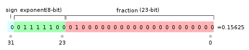

# 浮点数

根据国际标准IEEE 754，任意一个二进制浮点数V可以表示成下面的形式：

> 　
>
> 　　**（1）(-1)^s表示符号位，当s=0，V为正数；当s=1，V为负数。**
>
> 　　**（2）M表示有效数字，大于等于1，小于2。**
>
> 　　**（3）2^E表示指数位。**

举例来说，十进制的5.0，写成二进制是101.0，相当于1.01×2^2。那么，按照上面V的格式，可以得出s=0，M=1.01，E=2。

十进制的-5.0，写成二进制是-101.0，相当于-1.01×2^2。那么，s=1，M=1.01，E=2。

IEEE 754规定，对于32位的浮点数，最高的1位是符号位s，接着的8位是指数E，剩下的23位为有效数字M。

